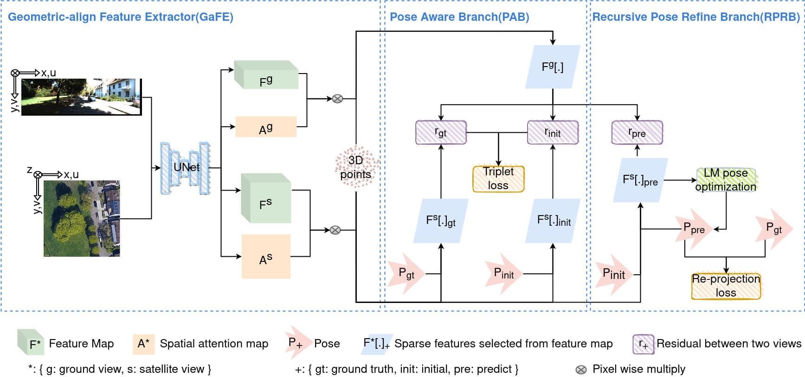

# Satellite Image Based Cross-view Localization for Autonomous Vehicle

Satellite Image Based Cross-view Localization for Autonomous Vehicle, Shan Wang, Yanhao Zhang, Ankit Vora, Akhil Perincherry and Hongdong Li, ICRA 2023 [Paper](https://arxiv.org/abs/2207.13506)

## Abstract
Existing spatial localization techniques for autonomous vehicles mostly use a pre-built 3D-HD map, often constructed using a survey-grade 3D mapping vehicle, which is not only expensive but also laborious.  This paper shows that by using an off-the-shelf high-definition satellite image as a ready-to-use map, we are able to achieve cross-view vehicle localization up to a satisfactory accuracy, providing a cheaper and more practical way for localization.  
While the utilization of satellite imagery for cross-view localization is an established concept, the conventional methodology focuses primarily on image retrieval. This paper introduces a novel approach to cross-view localization that departs from the conventional image retrieval method. Specifically, our method develops (1) a Geometric-align Feature Extractor (GaFE) that leverages measured 3D points to bridge the geometric gap between ground and overhead views, (2) a Pose Aware Branch (PAB) adopting a triplet loss to encourage pose-aware feature extraction, and (3) a Recursive Pose Refine Branch (RPRB) using the Levenberg-Marquardt (LM) algorithm to align the initial pose towards the true vehicle pose iteratively. Our method is validated on KITTI and Ford Multi-AV Seasonal datasets as the ground view and Google Maps as the satellite view. The results demonstrate the superiority of our method in cross-view localization with median spatial and angular errors within $1$ meter and $1^\circ$, respectively.

<p align="center">
  <a href="https://github.com/ShanWang-Shan/SIBCL.git"></a>
</p>

## Installation

SIBCL is built with Python >=3.6 and PyTorch. The package includes code for both training and evaluation. Installing the package locally also installs the minimal dependencies listed in `requirements.txt`:

``` bash
git clone https://github.com/ShanWang-Shan/SIBCL.git
cd SIBCL/
pip install -e .
```

## Datasets

We construct our KITTI-CVL and Ford-CVL datasets by correcting the spatial-consistent satellite counterparts from Google Map \cite{google} according to these GPS tags. More specifically, we find the large region covering the vehicle trajectory and uniformly partition the region into overlapping satellite image patches. Each satellite image patch has a resolution of $1280\times 1280$ pixels. A script to download the latest satellite images is provided in (kitti/ford_data_process/downloading_satellite_iamges.py). If you need our collected satellite images, please first fill out this [Google Form](https://docs.google.com/forms/d/e/1FAIpQLSclyG85h6lGAsTRL7_B_VSPtjihHEILuyozSVrsl1Sq4uIE2w/viewform?), and we will send you the link for download.

KITTI-CVL: Please first download the raw data (ground images) from [http://www.cvlibs.net/datasets/kitti/raw_data.php](http://www.cvlibs.net/datasets/kitti/raw_data.php), and store them according to different dates (not category). The split files can be downloaded [here](https://drive.google.com/drive/folders/12NLX1uoQae4aevFL7nIuvsahbJZozlEx?usp=sharing). Your dataset folder structure should be like this:
```
Kitti/
├─ raw_data/
│  ├─ 2011_09_26/
│  │  ├─ 2011_09_26_drive_****_sync/
│  │  │  ├─ image_**
│  │  │  ├─ oxts/
│  │  │  ├─ velodyne_points/
│  │  ├─ calib_cam_to_cam.txt
│  │  ├─ calib_imu_to_velo.txt
│  │  └─ calib_velo_to_cam.txt
│  ├─ 2011_09_28/
│  ├─ 2011_09_29/
│  ├─ 2011_09_30/
│  ├─ 2011_10_03/
│  ├─ gps.csv
│  ├─ groundview_satellite_pair_18.npy
│  ├─ satellite_gps_center.npy
│  └─ kitti_split/
│     ├─ test_files.txt
│     ├─ val_files.txt
│     └─ train_files.txt
└─ satmap_18/
   └─ satellite_*_lat_*_long_*_zoom_18_size_640x640_scale_2.png 
```

Ford-CVL: Please first download the raw data (ground images) from [https://avdata.ford.com/](https://avdata.ford.com/). We provide the script(ford_data_process/raw_data_downloader.sh) for raw data download and the script(ford_data_process/other_data_downloader.sh) for processed data download. Your dataset folder structure should be like this. If the link in the script file has expired or lacks the necessary permissions, please contact us.
```
FordAV/
├─ 2017-08-04-V2-Log*/
│  ├─ 2017-08-04-V2-Log*-FL/
│  │  └─ *******.png
│  ├─ 2017-08-04-V2-Log*-RR/
│  ├─ 2017-08-04-V2-Log*-SL/
│  ├─ 2017-08-04-V2-Log*-SR/
│  ├─ info_files/
│  │  ├─ gps.csv
│  │  ├─ gps_time.csv
│  │  ├─ imu.csv
│  │  ├─ pose_ground_truth.csv
│  │  ├─ pose_localized.csv
│  │  ├─ pose_raw.csv
│  │  ├─ pose_tf.csv
│  │  ├─ velocity_raw.csv
│  │  ├─ groundview_gps.npy
│  │  ├─ groundview_NED_pose_gt.npy
│  │  ├─ groundview_pitchs_pose_gt.npy
│  │  ├─ groundview_yaws_pose_gt.npy
│  │  ├─ groundview_satellite_pair.npy
│  │  ├─ satellite_gps_center.npy
│  │  ├─ 2017-08-04-V2-Log*-FL-names.txt
│  │  ├─ 2017-08-04-V2-Log*-RR-names.txt
│  │  ├─ 2017-08-04-V2-Log*-SL-names.txt
│  │  ├─ 2017-08-04-V2-Log*-SR-names.txt
│  ├─ pcd/
│  │  └─ *******.pcd
│  ├─ Satellit_Image_18
│  │  └─ satellite_*_lat_*_long_*_zoom_18_size_640x640_scale_2.png 
├─ 2017-10-26-V2-Log*/
└─ V2/
```
To update your dataset path, you can modify the "default_conf.dataset_dir" in the following files: "pixloc/pixlib/dataset/kitti.py" and "pixloc/pixlib/dataset/ford.py" or in your training/evaluation script. Additionally, if you wish to change the trajectory for the Ford-CVL dataset, you can adjust the "log_id_train/val/test" in the "pixloc/pixlib/dataset/ford.py" file.


## Models
Weights of the model trained on *KITTI-CVL* and *Ford-CVL*, hosted [here](https://drive.google.com/drive/folders/1myNYAREvbbJGoWyEYtzJ_fna_na1-buO?usp=drive_link).


## Evaluation

To perform the SIBCL, simply launch the corresponding run script:

```
python -m pixloc.evaluation
```

## Training

To train the SIBCL, simply launch the corresponding run script:

```
python -m pixloc.pixlib.train
```

## BibTex Citation

Please consider citing our work if you use any of the ideas presented in the paper or code from this repo:

```
@inproceedings{
  wang2023satellite,
  title={Satellite image based cross-view localization for autonomous vehicle},
  author={Wang, Shan and Zhang, Yanhao and Vora, Ankit and Perincherry, Akhil and Li, Hengdong},
  booktitle={2023 IEEE International Conference on Robotics and Automation (ICRA)},
  pages={3592--3599},
  year={2023},
  organization={IEEE}
}
```

Thanks to the work of [Paul-Edouard Sarlin](psarlin.com/) et al., the code of this repository borrows heavily from their [psarlin.com/pixloc](https://psarlin.com/pixloc) , and we follow the same pipeline to verify the effectiveness of our solution.
