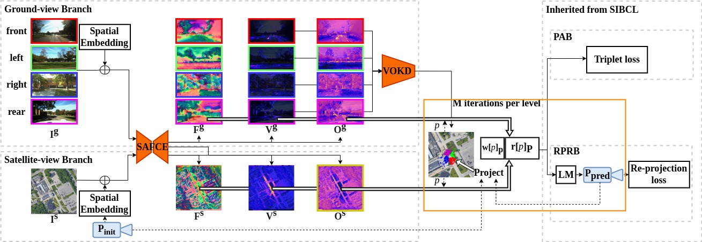

# Satellite Image Guided Localization for Autonomous Vehicle

The implementation of Satellite Image Guided Localization for Autonomous Vehicle, Shan Wang, Yanhao Zhang and Hongdong Li, IROS 2022 [Paper](https://arxiv.org/abs/2103.09213)

## Abstract
Existing autonomous vehicle localization techniques are mostly based on a pre-constructed large-scale high-definition 3D map, often captured by using an expensive survey-grade mapping vehicle involving laborious post-processing.  In contrast, using off-the-shelf satellite images as a ready-to-use map to achieve cross-view localization brings an alternative and promising way for low-cost localization.  However, previous cross-view localization methods almost exclusively treat the localization task as an image retrieval problem,  matching a vehicle-captured ground-view image with the satellite image, hence they only achieve coarse level localization. This paper presents a novel and highly accurate cross-view localization method departing from the common wisdom of image retrieval. Specifically, our method develops (1) a Geometric-align Feature Extractor (GaFE) that leverages measured 3D points to bridge the geometric gap between ground view and overhead view, (2) a Pose Aware Branch (PAB) adopting a triplet loss to encourage pose aware feature extracting, and (3) a Recursive Pose Refine Branch (RPRB) using the Levenberg-Marquardt (LM) algorithm to iteratively align the initial pose towards the true vehicle pose. Our method is validated on KITTI dataset as ground view and Google Maps as satellite view. The results demonstrate the superiority of our method in cross-view localization with spatial and angular errors limited to within 1 meter and 2°, respectively.

<p align="center">
  <a href="https://github.com/ShanWang-Shan/SIGLNet.git"></a>
</p>

Thanks to the work of [Paul-Edouard Sarlin](psarlin.com/) et al., the code of this repository borrow heavly from their [psarlin.com/pixloc](https://psarlin.com/pixloc) , and we follw the same pipeline to verify the effectiveness of our solution.


## Installation

SIGLNet is built with Python >=3.6 and PyTorch. The package includes code for both training and evaluation. Installing the package locally also installs the minimal dependencies listed in `requirements.txt`:

``` bash
git clone https://github.com/ShanWang-Shan/SIGLNet.git
cd SIGLNet/
pip install -e .
```

## Datasets

We construct our KITTI-CVL dataset by correcting the spatial-consistent satellite counterparts from Google Map \cite{google} according to these GPS tags. More specifically, we find the large region covering the vehicle trajectory and uniformly partition the region into overlapping satellite image patches. Each satellite images patch has a resolution of $1280\times 1280$ pixels, amounting to about 5cm per pixel. This dataset is hosted [here](https://cvg-data.inf.ethz.ch/pixloc_CVPR2021/checkpoints/).
Weights of the model trained on *KITTI-CVL*, hosted [here](https://cvg-data.inf.ethz.ch/pixloc_CVPR2021/checkpoints/).


## Evaluation

To perform the SIGLNet, simply launch the corresponding run script:

```
python -m pixloc.evaluation
```

## Training

To train the SIGLNet, simply launch the corresponding run script:

```
python -m pixloc.pixlib.train
```

## BibTex Citation

Please consider citing our work if you use any of the ideas presented the paper or code from this repo:

```
@inproceedings{sarlin21pixloc,
  author    = {Paul-Edouard Sarlin and
               Ajaykumar Unagar and
               Måns Larsson and
               Hugo Germain and
               Carl Toft and
               Victor Larsson and
               Marc Pollefeys and
               Vincent Lepetit and
               Lars Hammarstrand and
               Fredrik Kahl and
               Torsten Sattler},
  title     = {{Back to the Feature: Learning Robust Camera Localization from Pixels to Pose}},
  booktitle = {CVPR},
  year      = {2021},
}
```
